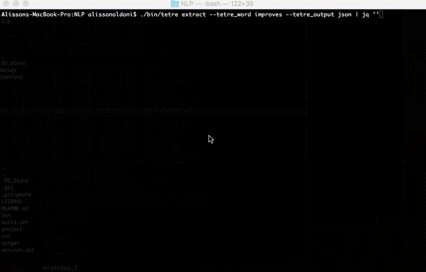

# TETRE: A TOOLKIT FOR EXPLORING TEXTS FOR RELATION EXTRACTION

<p align="center">
    
</p>

TETRE is mainly a tool that uses the SpaCy dependency parser to identify relations of entities in text using rules applied to the dependency tree, having the relation word and the raw text as an input. This tool and its built in rule-set was optimised for the task of information extraction in a corpus composed of academic papers.

TETRE is a commandline tool with functions that do data transformation, parsing, wraps tasks of third-party binaries (such as the Stanford CorNLP), and outputs the relations in both HTML and JSON. It uses [Pickle](https://docs.python.org/3/library/pickle.html) to cache parsed dependency trees for fast iteration when producing or fine-tuning rules.

For full description of TETRE's justification and inner workings of the rule-based approach can be found at my thesis repo at: https://raw.githubusercontent.com/aoldoni/comp9596-master-thesis/master/thesis.pdf



### HELLO WORLD

- Install TETRE and its dependencies (see [Installation](#installation)).

- Move your raw text data into `data/input/raw`:  
    `cp -R my_raw_text_files/* data/input/raw/`

- Process your relation:  
    `./bin/tetre extract --tetre_word improves --tetre_output json | jq ''`

- The output will be the JSON relations, such as:

```json
[
  {
    "other_relations": [],
    "relation": {
      "obj": "statistical machine translation methods",
      "rel": "improves",
      "subj": "noun phrase translation subsystem"
    },
    "rules_applied": "Growth.replace_subj_if_dep_is_relcl_or_ccomp,Subj.remove_tags",
    "sentence": "In addition, Koehn and Knight  show that it is reasonable to define noun phrase translation without context as an independent MT subtask and build a noun phrase translation subsystem that improves statistical machine translation methods.\n"
  },
  {
    "other_relations": [],
    "relation": {
      "obj": "chronological ordering significantly",
      "rel": "improves",
      "subj": "proposed algorithm"
    },
    "rules_applied": "Reduction.remove_tags,Obj.remove_tags,Subj.remove_tags",
    "sentence": "The evaluation results show that the proposed algorithm improves the chronological ordering significantly.\n"
  },
  {
    "other_relations": [],
    "relation": {
      "obj": "performance of the classifier over all categories",
      "rel": "improves",
      "subj": "combination of the two different types of representations"
    },
    "rules_applied": "Reduction.remove_tags,Obj.remove_tags,Subj.remove_tags",
    "sentence": "They show that concept-based representations can outperform traditional word-based representations, and that a combination of the two different types of representations improves the performance of the classifier over all categories.\n"
  },
  ...
```

# INSTALLATION

- Download TETRE:  
    `mkdir tetre`  
    `cd tetre`  
    `git clone https://github.com/aoldoni/tetre.git .`  

- Create directories:  
    `./bin/tetre setup`
    
- Prepare the static assets link:  
    `cd data/output/html/`  
    `ln -s ../../../templates/assets/ assets`  
    `cd ../../..`  

The next steps depend on what TETRE submodules you will be trying to run. In case of MacOS, you might want to replace some of these steps with using `brew`. Information to installing brew can be found at http://brew.sh/.


### INSTALLATION PYTHON DEPENDENCIES

- Install Python: http://docs.python-guide.org/en/latest/starting/installation/
    - This program expects Python 2 to be running as `python`.
    - This program expects Python 3 (at least 3.4) to be running as `python3`.

- Install PIP: https://pip.pypa.io/en/stable/installing/ - please install it using `python3` so all packages will be installed under the new version. This is important since if you install pip under `python` (i.e. for Python 2) the packages installed will not work in the python3 version of the code. E.g.: `python3 get_pip.py`

- Create a virtual environment. From now onwards, all the package installations will only be available in this directory/virtual environment:  
    `virtualenv .env`  
    `source .env/bin/activate`  

- Install Graphviz binaries: http://www.graphviz.org/Download.php
- Install jq for the demo: https://stedolan.github.io/jq/ (or you might just want to pipe the TETRE output to `python -m json.tool` instead)

- Install the following Python/Python3 modules:  
    - requests
    - BeautifulSoup4

E.g.:  
    `python3 -m pip install requests BeautifulSoup4`


### INSTALLATION MAIN PYTHON PACKAGES

- Install Spacy 0.101.0, Virtualenv, and Spacy's English model: https://spacy.io/docs/#getting-started
    `python3 -m pip install spacy==0.101.0`  
    
- Install NLTK (as a python3 module): http://www.nltk.org/install.html
- Install Brat 1.3 Crunchy Frog: http://brat.nlplab.org/installation.html
- Install the following Python/Python3 modules:
    - nltk
    - corpkit
    - corenlp-xml
    - django
    - graphviz

E.g.:  
    `python3 -m pip install nltk corpkit corenlp-xml django graphviz`


### INSTALLATION EXTERNAL PACKAGES 

These are optional packages, mostly if you want to explore available wrappers for the Stanford's relation extractor and NER processes, or
if you want to compare the TETRE output with the externally available tools.

IMPORTANT: You may skip to the [Hello World](#hello-world) or [Usage](#submodules-and-usage) sections if your intention is simply to use TETRE stand-alone.

#### INSTALLATION STANDOFF2OTHERS

As part of TETRE development, another library with a modified version of Sampo Pyysalo's library https://github.com/spyysalo/standoff2conll was created and available in https://github.com/aoldoni/standoff2conll - this mofied version generates files in the Stanford's Relation Extractor training formart, based on the Brat's annotation standoff format.

To install, please do:

1. Go to `cd external/lib/standoff2other`
2. Run `git clone https://github.com/aoldoni/standoff2conll.git .`

#### INSTALLATION STANFORD'S CORENLP

1. Install Java: http://www.oracle.com/technetwork/java/javase/downloads/jre8-downloads-2133155.html
2. Install Maven: https://maven.apache.org/install.html

3. Move into created directory:  
    `cd external/bin/stanford`

4. Download the jars for:
    - NER (release from 2015-12-09).
    - Full CoreNLP (release 3.6.0).

5. Extract them inside the respective folder folder, thus having the following subdirectories, respectivelly:
    - `external/bin/stanford/ner/`
    - `external/bin/stanford/corenlp/`

6. Inside `external/bin/stanford/corenlp/src` replace the code with the modified 3.6.0 version from:  
    `cd external/bin/stanford/corenlp/src`  
    `rm -rf *`  
    `git clone https://github.com/aoldoni/stanford-corenlp .`  

This is needed as this modified version implements the custom relations and entity types described in the [thesis PDF](https://raw.githubusercontent.com/aoldoni/comp9596-master-thesis/master/thesis.pdf).

7. Return to root directory:
    `cd ../../../../../`

8. Install `ant` (e.g.: using `brew` or `apt-get`). Then re-compile stanford's binaries:
    `./bin/tetre compile`

9. The file `external/bin/stanford/corenlp/stanford-corenlp-compiled.jar` should now exist.

#### INSTALLATION GOOGLE'S PARSEY

1. Move into created directory:  
    `cd external/bin/parsey`

2. Install Google Syntaxnet: https://github.com/tensorflow/models/tree/master/syntaxnet#installation

3. Copy custom initiator file for syntaxnet available inside this project into the correct directory:   
    `cp external/extra/google-parsey/google.sh external/bin/parsey/models/syntaxnet/syntaxnet/google.sh`

#### INSTALLATION CLAUSEIE

1. Move into created directory:  
    `cd external/bin/clausie`

2. Download ClauseIE from http://resources.mpi-inf.mpg.de/d5/clausie/clausie-0-0-1.zip and extract into this folder.


#### INSTALLATION ALLENAI OPENIE

1. Move into created directory:  
    `cd external/bin/allenai_openie`

2. Run installation process found in https://github.com/allenai/openie-standalone#command-line-interface


# SUBMODULES AND USAGE

TETRE is organised arounds steps and workflows. The available steps are:  
```
/bin/tetre --help
usage: tetre [-h]
             {setup,download,preprocess,train,compile,extract,postprocess} ...

TETRE, a humble Toolkit for Exploring Text for Relation Extraction

positional arguments:
  {setup,download,preprocess,train,compile,extract,postprocess}
    setup               Generate needed setup folders
    download            Download content from a given server (originally
                        developed for internal UNSW server only)
    preprocess          Preprocessing jobs for supported workflows.
    train               Train models for supported workflows.
    compile             Re-compile code for supported workflows.
    extract             Extract relations for supported workflows.
    postprocess         General postprocessing and supporting tasks.

optional arguments:
  -h, --help            show this help message and exit
```

More details on each steps:
- `download` : Used to download data (raw text) from the available server.
- `preprocess` : Data transformation steps, before training.
- `train` : Trigger the training for the Stanford CoreNLP (NER and RE). Regenerates the models to be used in the Stanford's CoreNLP based on anotated from Brat.
- `compile` : Recompile Stanford's full CoreNLP using Maven. This is needed for non-standard labels for NER/RE.
- `extract` : Runs SpaCy or Stanford CoreNLP to extract entities or relations.
- `postprocess` : Can be used to implement some ad-hoc tasks like agreegating details on the text.

In the majority of the steps are 3 main workflows supported:
- `tetre` : a custom technique for information extraction using SpaCy.
- `brat_to_stanford` : a full pipeline fmor annotation using brat, training NER/RE models in Stanford CoreNLP and classification.
- `openie_tools` : Open information extraction using external tools, currently mainly implemented for performance comparison with the TETRE specific process.

Not all steps are needed to all workflows: more specifically the TETRE workflow requires no training or data preparation. Paths and dependencies are maintained inside `lib/directories.py`.


### EXTRACTING A RELATION
- See [Hello World](#hello-world).


### ANALYSE A RELATION AND ITERATE

This workflow is more common when you are creating your own rules.

1. Use the `download` submodule.
2. All the papers "related.txt" should now be in the `data/input/downloaded` folder.
3. Move all `txt` files from `data/input/downloaded` to `data/input/raw`.
4. Make sure you are inside the proper Virtualenv (e.g.: `source .env/bin/activate`).
5. Run:  
    `./bin/tetre extract --tetre_word improves --tetre_behaviour simplified_groupby`
6. To analyse the subj relation instead run:  
    `./bin/tetre extract --tetre_word improves --tetre_behaviour simplified_groupby --tetre_behaviour_root subj` 

Notes:
- Change the behaviour to `groupby` in case you want to group sentences as is, without applying any simplification rules.
- The script behaviour is to simply replace the content of the output folder (normally `data/output/html`) with newly generated, so please backup the outputs as you go. Please leave the `assets` symbolic link folder inside `data/output/html`.
- The word `improves` can also be changed to any word, e.g.: `enhances`, etc. For the top relations in your text, please run: `./bin/tetre postprocess --workflow stats` as this will output the more common relations you can attempt to extract, for an example:
```
is,41694
has,8157
does,2584
uses,2345
provides,1109
requires,949
allows,941
focuses,752
makes,610
supports,566
proposes,537
contains,536
shows,499
includes,485
differs,468
considers,464
takes,454
relies,432
needs,400
works,385
performs,38
...
```


### INCORPORATE RESULTS FROM OTHER TOOLS

This is more useful when collecting results from other tools for human comparison in the HTML output.

1. Run the below to prepare the segmented sentences for the relation being searched for:  
    `./bin/tetre extract --tetre_word improves --openie_prepare_sentences`

2. Run the below to execute the external tool:  
    `./bin/tetre extract --tetre_word improves --openie_run_others AllenAIOpenIE`

3. Re-run the below to incorporate results from external tools:  
    `./bin/tetre extract --tetre_word improves --tetre_include_external`

4. Or generate a sample HTML with CSV document for marking (human comparison of the results):  
    `./bin/tetre extract --tetre_word improves --tetre_include_external --tetre_sampling 6.5 --tetre_seed 99879 --tetre_output html_csv`

Notes:
- Results are always available in the `data/output/html` section.
- Other options are AllenAIOpenIE, MPICluaseIE or StanfordOpenIE.


### OTHER USAGES

Force reprocessing (avoid cache):  
- `./bin/tetre extract --tetre_word improves --tetre_force`


# NOTES

- See [this issue](https://github.com/stanfordnlp/CoreNLP/issues/359), [this repository](https://github.com/aoldoni/stanford-corenlp), and [these notes](https://github.com/aoldoni/standoff2conll/tree/develop#custom-entities-in-stanford-re-training) for information on the customizations needed for the Stanford's Relation Extractor to run with different entities.


# LICENSE

Copyright (c) 2017 Alisson Oldoni [MIT License](LICENSE)